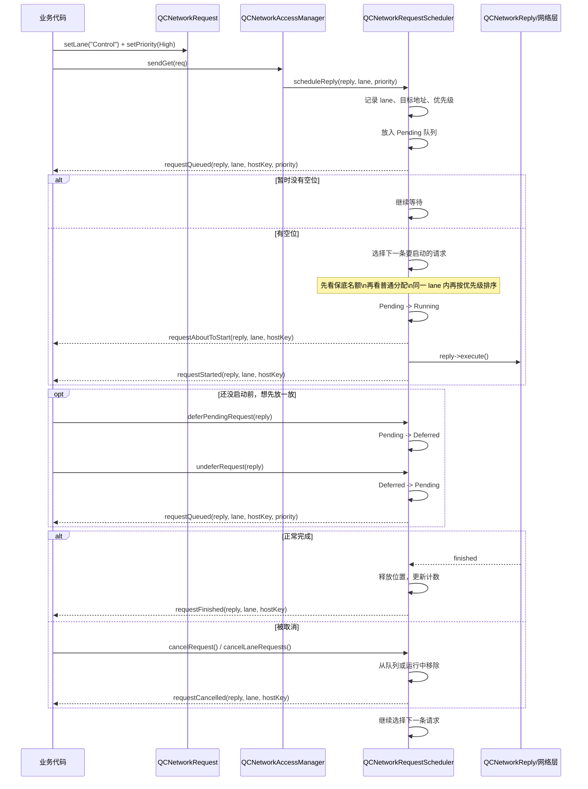

# Lane Scheduler（把请求分车道来调度）

> 本页面面向 **QCurl 使用者（下游项目）**，说明 `lane` 是什么、它怎么工作、以及你应该怎么用。  
> **Ground Truth：** 如本文与代码不一致，以 `src/QCNetworkRequest.h`、`src/QCNetworkRequestScheduler.h` 和相关测试为准。
> `QCNetworkRequestScheduler.h` 属于 **Core install surface**：下游可直接 include 并按本文 contract 使用。

## 1. 先用一句话理解 `lane`

可以把 `lane` 理解成“请求车道”。

以前如果很多请求一起进来，大家主要靠优先级排队。现在多了一层“先分车道，再在车道里排队”的规则。

这样做的目的很简单：

- 让登录、拉配置、心跳、提交订单这类“小而重要”的请求，不容易被大下载、大上传堵住。
- 让下载、上传、后台同步这些“重请求”能持续推进，但不要把关键请求全部挤掉。
- 让调用方可以按“请求类别”整批管理，比如一口气取消某条车道上的下载请求。

## 2. 什么时候应该用 `lane`

如果你的业务里同时存在下面几类请求，就很适合用 `lane`：

- 控制类请求：登录、刷新 token、拉配置、拉清单、状态检查、心跳
- 传输类请求：下载文件、上传文件、分片传输
- 后台类请求：埋点、预热、非关键同步、后台刷新

如果你的应用只有很少量请求，而且彼此差不多重要，那也可以先不分车道，直接使用默认 lane。

## 3. 它到底做了什么

`lane` 不只是一个标签，它会真正影响调度器的行为。

### 3.1 每个请求都可以带上自己的车道

`QCNetworkRequest` 提供了：

- `setLane(const QString &lane)`
- `lane() const`

空字符串表示默认车道。

```cpp
QCurl::QCNetworkRequest req(QUrl("https://api.example.com/manifest"));
req.setLane(QStringLiteral("Control"));
```

### 3.2 调度器会先看“哪条车道该先走”

调度器挑下一个要启动的请求时，不是只盯着单个请求，而是大致按下面的顺序考虑：

1. 先看有没有哪条车道配置了“保底名额”，而且现在还没占满
2. 如果没有，再按各条车道的权重分配机会
3. 进入某条车道后，再按这条车道里的优先级挑请求

可以把它理解成：

- `lane` 决定“这次轮到哪一类请求”
- `priority` 决定“这类请求里谁先上”

### 3.3 可以给重要车道留位置

`QCNetworkRequestScheduler::LaneConfig` 里最重要的是这两个字段：

- `reservedGlobal`：给这条车道在全局上留几个运行位置
- `reservedPerHost`：给这条车道在同一个目标站点上留几个运行位置

这两个值的作用是“保底”。

比如：

- 总并发是 6
- 下载很多
- 但你给 `Control` 配了 `reservedGlobal = 2`

那么调度器会尽量保证控制类请求一直有机会启动，而不是被下载请求全部占满。

### 3.4 可以按车道整批取消

你可以直接取消某条车道上的请求：

```cpp
scheduler->cancelLaneRequests(
    QStringLiteral("Transfer"),
    QCurl::QCNetworkRequestScheduler::CancelLaneScope::PendingAndRunning);
```

scope 语义：

- `PendingOnly`：只清理 pending + deferred，不打断已 running 请求
- `PendingAndRunning`：pending + deferred + running 一并取消（用于整条 lane 排空）

这很适合下面的场景：

- 用户点击“暂停所有下载”
- 切换账号后，取消某类后台同步
- 页面关闭后，批量清掉某条业务车道上的请求

### 3.5 现在的调度信号会带上 `lane`

下面这些信号现在都会带上 `lane` 和 `hostKey`：

- `requestQueued(reply, lane, hostKey, priority)`
- `requestAboutToStart(reply, lane, hostKey)`
- `requestStarted(reply, lane, hostKey)`
- `requestFinished(reply, lane, hostKey)`
- `requestCancelled(reply, lane, hostKey)`

并且有两个需要明确的 contract：

- 这些信号都在 **scheduler owner thread** 发射，不会漂移到“谁来调用 scheduler API”的线程。
- `requestAboutToStart` 的语义是：“scheduler owner thread 已进入即将调用 `reply->execute()` 的
  handoff（最后可拦截点）”。如果你在该信号的 direct slot 里调用 `cancelRequest()`，
  调度器将不会再调用 `execute()`，也不会发射 `requestStarted`。
- `requestStarted` 的语义是：“scheduler owner thread 已完成对 `reply->execute()` 的调用（启动提交点）”，
  不再表达 about-to-start。

这意味着你在日志、监控、测试里，更容易看清楚“是哪条车道的请求正在排队、启动、完成或取消”。

## 4. 请求是怎么流转的

下面这张图展示了一个请求从进入到结束的大致过程。



如果你只记一件事，可以记这个：

- 请求先进队列
- 调度器先决定“轮到哪条 lane”
- 再决定“这条 lane 里谁先跑”
- 请求结束后，空出来的位置再给后面的请求

## 5. 推荐的车道划分

对大多数客户端业务，比较推荐先从这三条 lane 开始：

### 5.1 `Control`

适合放：

- 登录
- 刷新 token
- 拉配置
- 拉资源清单
- 心跳
- 提交订单
- 支付确认

特点：

- 数量通常不多
- 单个请求通常不大
- 对用户体验影响明显

建议优先级：

- 常用：`High` 或 `VeryHigh`
- 只有极少数真的很急的，才用 `Critical`

### 5.2 `Transfer`

适合放：

- 文件下载
- 文件上传
- 分片下载
- 分片上传

特点：

- 请求数可能很多
- 单个请求可能持续时间很长
- 吞吐重要，但不该压住控制类请求

建议优先级：

- 常用：`Normal`
- 不重要的大批量任务：`Low`

### 5.3 `Background`

适合放：

- 埋点
- 缓存预热
- 后台刷新
- 非关键同步

特点：

- 通常不需要马上完成
- 适合在系统空闲时慢慢跑

建议优先级：

- `Low` 或 `VeryLow`

## 6. 一套比较稳的默认建议

下面这套配置适合“有接口请求 + 有下载上传 + 有后台任务”的常见客户端：

```cpp
auto *scheduler = manager.scheduler();

QCurl::QCNetworkRequestScheduler::Config cfg;
cfg.setMaxConcurrentRequests(6);
cfg.setMaxRequestsPerHost(2);
cfg.setMaxBandwidthBytesPerSec(0);
cfg.setEnableThrottling(false);
scheduler->setConfig(cfg);

QCurl::QCNetworkRequestScheduler::LaneConfig control;
control.setWeight(4);
control.setQuantum(1);
control.setReservedGlobal(2);
control.setReservedPerHost(1);
scheduler->setLaneConfig(QStringLiteral("Control"), control);

QCurl::QCNetworkRequestScheduler::LaneConfig transfer;
transfer.setWeight(2);
transfer.setQuantum(1);
transfer.setReservedGlobal(0);
transfer.setReservedPerHost(0);
scheduler->setLaneConfig(QStringLiteral("Transfer"), transfer);

QCurl::QCNetworkRequestScheduler::LaneConfig background;
background.setWeight(1);
background.setQuantum(1);
background.setReservedGlobal(0);
background.setReservedPerHost(0);
scheduler->setLaneConfig(QStringLiteral("Background"), background);
```

这组值的意思可以直接这样理解：

- `Control` 最重要，所以它拿到机会最多
- `Control` 还保留了全局和单站点名额，不容易被下载压死
- `Transfer` 持续工作，但优先级低于 `Control`
- `Background` 最容易让路

## 7. 推荐怎么把请求放进不同 lane

```cpp
QCurl::QCNetworkRequest manifestReq(QUrl("https://api.example.com/manifest"));
manifestReq.setLane(QStringLiteral("Control"))
           .setPriority(QCurl::QCNetworkRequestPriority::High);

QCurl::QCNetworkRequest downloadReq(QUrl("https://cdn.example.com/chunk.bin"));
downloadReq.setLane(QStringLiteral("Transfer"))
           .setPriority(QCurl::QCNetworkRequestPriority::Normal);

QCurl::QCNetworkRequest telemetryReq(QUrl("https://api.example.com/telemetry"));
telemetryReq.setLane(QStringLiteral("Background"))
            .setPriority(QCurl::QCNetworkRequestPriority::Low);
```

你可以先按下面的规则分：

| 请求类型 | 推荐 lane | 推荐 priority |
| --- | --- | --- |
| 登录、刷新 token、拉配置 | `Control` | `High` |
| 清单、版本检查、状态检查 | `Control` | `High` 或 `VeryHigh` |
| 下载分片、上传分片 | `Transfer` | `Normal` |
| 批量下载、预下载 | `Transfer` | `Low` |
| 埋点、后台同步、预热 | `Background` | `Low` 或 `VeryLow` |

## 8. 你应该知道的几个关键规则

### 8.1 `Critical` 不再是“无敌插队”

这是最容易误解的一点。

现在的 `Critical` 表示：

- 在**同一条 lane 内**，它会比别的 pending 请求更早启动
- 但它**仍然要遵守**全局并发、单站点并发和限流这些硬限制

所以：

- 如果你只是想让一条控制请求在自己那类请求里更靠前，用 `Critical` 可以
- 如果你想保证“控制类请求永远留有位置”，应该配 `reservedGlobal` / `reservedPerHost`

### 8.2 `lane` 先分组，`priority` 再排序

简单说就是：

- `lane` 决定“哪一类请求先获得机会”
- `priority` 决定“这类请求内部谁先走”

不要只调 `priority`，却完全不分 lane。那样在下载很多时，控制类请求还是可能被整体拖慢。

### 8.3 `deferPendingRequest()` 不是“暂停下载”

`deferPendingRequest()` 只对还没启动的请求生效。

它表达的是：

- “先不要调度这个请求”

它不表达：

- “保留这次传输的进度，稍后继续下载”

如果请求已经在跑，想释放位置，应该显式取消；如果你要的是真正的传输级暂停/恢复，应使用 reply 侧的 pause/resume 能力，而不是 scheduler 的 defer/undefer。

### 8.4 可以按 lane 做日志和观测

推荐至少把 `requestAboutToStart/requestStarted` 和 `requestCancelled` 打到日志里，这样你能快速看出：

- 哪条 lane 最忙
- 某条 lane 是否被饿住了
- 某个批量取消操作是否真的取消到了目标请求

### 8.5 `scheduler()` 是 owner-thread only；跨线程请投递配置动作

`QCNetworkAccessManager::scheduler()` 只允许在 **manager owner thread** 上调用。
它返回 owner thread 当前使用的 thread-local scheduler，不会在跨线程场景下偷偷创建调用线程自己的 scheduler。

因此：

- 必须在 **manager owner thread** 上获取并配置 scheduler。
- 在别的线程调用 `manager.scheduler()` 会 warning + fail-closed 返回 `nullptr`。
- Core 不提供透明跨线程阻塞 getter；需要跨线程配置时，把“配置动作”显式投递到 manager owner thread。

推荐做法：

```cpp
auto *manager = new QCurl::QCNetworkAccessManager(this);

// 在 manager 所在线程中配置
auto *scheduler = manager->scheduler();
scheduler->setConfig(...);
scheduler->setLaneConfig(QStringLiteral("Control"), ...);
```

跨线程配置示例：

```cpp
QMetaObject::invokeMethod(
    manager,
    [manager] {
        auto *scheduler = manager->scheduler(); // owner-thread only
        if (!scheduler) {
            return;
        }
        scheduler->setLaneConfig(QStringLiteral("Control"), ...);
    },
    Qt::QueuedConnection);
```

使用建议：

- 避免在持锁状态、析构函数、以及 UI/主线程高频热路径里等待跨线程结果。
- 在 owner thread 初始化阶段完成 scheduler 的获取与配置。
- 跨线程场景优先传递配置命令，而不是同步取回 scheduler 指针。

## 9. 一些实用建议

- 不要把所有请求都塞进 `Control`，否则 lane 就失去意义了。
- `reservedGlobal` 的总和不要大于 `maxConcurrentRequests`。
- `reservedPerHost` 不要大于 `maxRequestsPerHost`。
- 如果你的总并发只有 2 或 3，建议先把 `Control.reservedGlobal()` 设为 1。
- 如果下载明显太慢，可以先把 `Transfer.weight()` 从 2 调到 3，再观察。
- 如果登录、拉配置仍然偶尔慢，优先检查：
  - 这些请求是否真的被放进了 `Control`
  - `Control` 是否配置了保底名额
  - 是否把太多不重要的请求也放进了高优先级

## 10. 使用注意

- 调度器信号带 `lane` 和 `hostKey`。
- `hostKey` 的格式固定为 `scheme://host:effectivePort`。
  - `http/https/ws/wss` 会补默认端口。
  - IPv6 会写成 `scheme://[v6]:port`。
  - 未知 scheme 且 URL 没显式端口时，`effectivePort` 固定为 `0`。
- `deferPendingRequest()` / `undeferRequest()` 只表达调度层“先别启动/重新入队”，不表达传输级 pause/resume。
- `QCNetworkAccessManager::scheduler()` 是 owner-thread only；跨线程误用会 warning + 返回 `nullptr`。
- 跨线程配置 scheduler 时，把配置动作投递到 owner thread 执行。
- `requestAboutToStart` 表示“即将调用 `reply->execute()`（最后可拦截点）”。
- `requestStarted` 表示“已完成 `reply->execute()` 调用（启动提交点）”。
- 异步 scheduler / reply 依赖 owner thread 的 Qt 事件循环；如果线程退出或事件循环停止，先前排队的 queued invoke 不再保证送达。

## 11. 相关文档

- 常见配置：`docs/user/configuration.md`
- 快速开始：`docs/user/quickstart.md`
- Flow Control（传输级 pause/resume）：`docs/user/flow-control.md`
- 项目总览与示例：`README.md`
